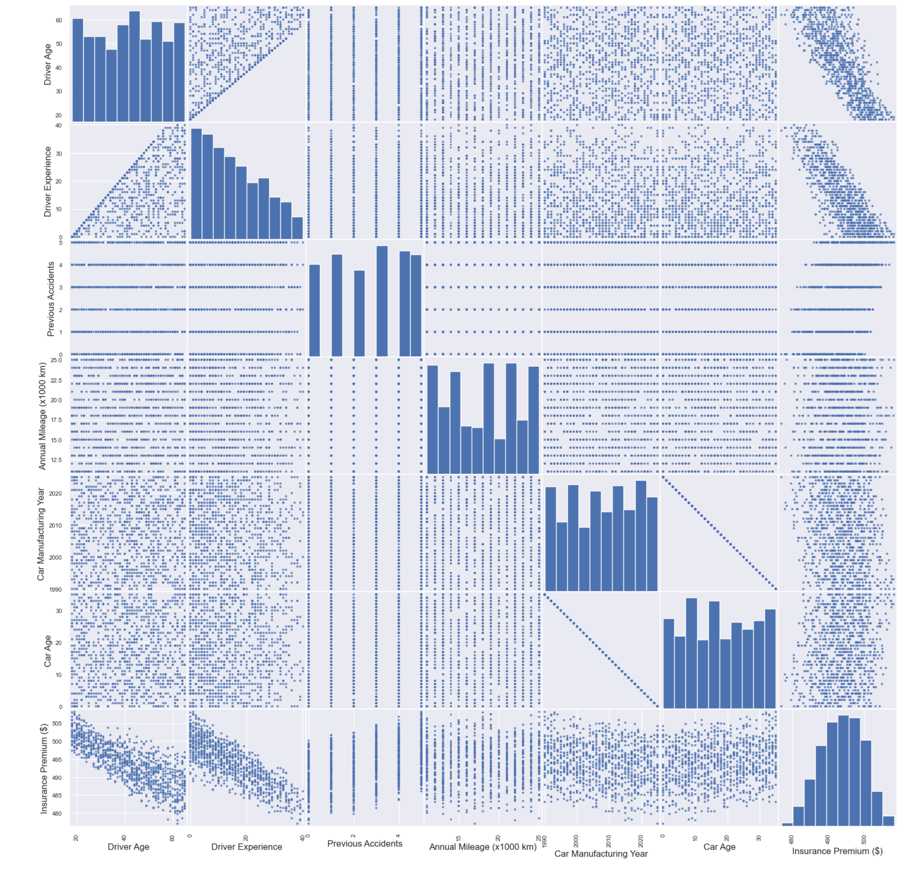

# Car Inssurance Cost Prediction


This project is a Flask-based web application that predicts car 
insurance costs using an ensemble of machine learning models. The prediction models were trained 
using a dataset of 1000 records with various driver and vehicle attributes you can 
find it [Here](https://www.kaggle.com/datasets/govindaramsriram/car-insurance-premium-dataset) .
## Dataset Features
The dataset contains the following features:

- `Driver Age`: Age of the driver
- `Driver Experience` : Years of driving experience
- `Previous Accidents` : Number of previous accidents
- `Annual Mileage`: Distance driven annually (x1000 km)
- `Car Manufacturing Year`: Year the car was manufactured
- `Car Age`: Age of the car
- `Insurance Premium` : Cost of insurance in USD (target variable)

The dataset has a shape of `(1000, 7)`.


---

## Project Structure

# 📁 Medical-Inssurance
```
├── 📂.venv
├── 📂 template
├── 📄 app.py
├── 📄 car_insurance_dataset.csv
├── 📄 gb_model.pkl 
├── 📄 linear_model.pkl 
├── 📄 knn_model.pkl 
├── 📄 rf_model.pkl 
├── 📄 svr_model.pkl 
├── 📄 Car_Insurance.ipynb
├── 📄 requirements.txt
└── 📄 Scaler.pkl
```
---

## Installation and Setup

### Prerequisites
- Python 3.8 or later
- Pip for managing dependencies
- Virtual environment (recommended)

### Steps

1. Clone this repository:
```bash
   git clone <repository-url>
   cd Car-Insurance
```
```bash   
    python -m venv .venv
    source .venv/bin/activate  # On Windows: .venv\Scripts\activate
```
```bash 
    pip install -r requirements.txt
```
```bash
    python app.py
```

### Scatter Matix of the dataset :

<div style="text-align: center;">
    
</div>


## Data Processing 

<div style="text-align: center;">
    
</div>

The dataset was already clean, so I did not need to perform additional 
preprocessing like handling missing values or encoding values . However, 
the following steps were performed to prepare the data for training 
the prediction model :

### 2. Feature Selection :
To determine the most relevant features for
predicting medical insurance costs, I applied three feature
selection techniques: `Univariate Selection`, **Principal Component Analysis** `PCA`, 
and **Recursive Feature Elimination** `RFE`. The results are as follows :

#### 2.1 Univariate Selection:
Using statistical tests, I selected 
the features most strongly correlated with the target variable 
`Insurance Premium`. Selected Features:
`Driver Age`, `Driver Experience`, `Previous Accidents` . 


#### 2.2 Principal Component Analysis ( PCA ) :
PCA was used to identify the top features contributing 
to the variance in the dataset. The top 3 features based on PCA are:
`Annual Mileage (x1000 km)`, `Car Manufacturing Year`, `Previous Accidents`


#### 2.2 Recursive Feature Elimination (RFE):
RFE was applied to iteratively select features by recursively considering smaller and smaller feature sets.
Selected Features : `Previous Accidents`, `Driver Experience`, `Driver Age`


## Model Training and Evaluation

This project uses an **Averaging Technique** 
with 5 models to predict loan approval status. 
Below are the steps involved in the process:


### Data Preprocessing

1. **Feature Scaling**: The features were standardized using `StandardScaler` to normalize the data and ensure consistent scaling.
2. **Train-Test Split**: The dataset was split into training and testing sets (default 75%-25%) using `train_test_split` with a fixed `random_state=10` for reproducibility.

### Model Selection and Training

**Base Models** ➡️ Five different models were selected:

➡️ `Logistic Regression`

➡️ `Random Forest Classifier`

➡️ `Gradient Boosting Classifier`

➡️ `Support Vector Machine (SVM)`

➡️ `K-Nearest Neighbors (KNN)`

**Averaging Technique** : The predictions from all five models were averaged to generate the final prediction.

**Training** : Each model was trained on the standardized training dataset `(X_train, y_train)`.

### Model Evaluation

The trained models were evaluated on the testing set 
(X_test, y_test) using the following metrics:

- **R2 Score**
- **RMSE (Root Mean Square Error)**


#### Results:

- 


# Flask API for Car Insurance Cost Prediction

This project includes a **Flask API** that serves multiple trained machine learning models to predict car insurance costs based on user input. The API uses an ensemble approach, combining predictions from five 
different models to provide a robust and accurate estimate. 
Below is an overview of the functionality and structure of the API:

## API Overview

The API is built using **Flask**, a lightweight web framework for Python. 
It provides a Prediction Endpoint **(`/predict`)** that accepts user input in JSON format, 
processes the data, and returns the predicted insurance cost.

## Key Components

### 1.  Loading Models and Scaler
**Models** : **Five pre-trained models** are loaded using the **pickle** module:
- **Linear Regression** `(linear_model.pkl)`

- **Gradient Boosting** `(gb_model.pkl)`

- **K-Nearest Neighbors (KNN)** `(knn_model.pkl)`

- **Support Vector Regression (SVR)** `(svr_model.pkl)`

- **Random Forest** `(rf_model.pkl)`
- **Scaler** : A **StandardScaler** `(Scaler.pkl) `
is used to preprocess input data for compatibility with the models.

### 3. Prediction Endpoint (`/predict`)
- **Method**: `POST`
- **Input**: Accepts JSON data with the following keys:
    - `Driver Age`: Age of the driver.
    - `Driver Experience`: Years of driving experience.
    - `Previous Accidents`: Number of previous accidents.
- **Process**:

  1. Validates the input data to ensure all required keys are present.
  2. Converts the input data into a Pandas DataFrame with appropriate feature names.
  3. Scales the input data using the loaded `StandardScaler`.
  4. Makes predictions using all five models.
  5. Computes the average prediction from the ensemble of models.
- **Output**: Returns a JSON response with:
  1. `ensemble_prediction` : The average predicted insurance cost.
  
## Example Usage
### Request : 


### Responce : 


